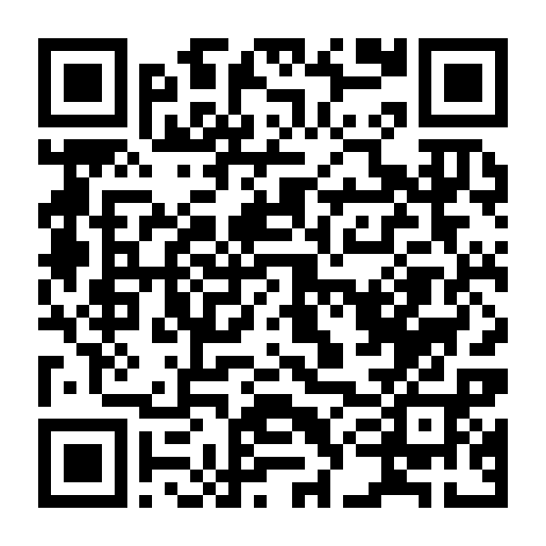
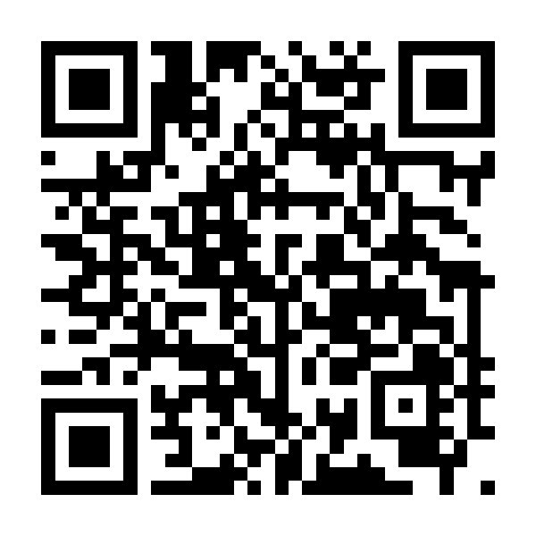

```{r}
#| include: false
library(ggplot2)
library(dplyr)
library(readr)

site_url     <- "https://dbetebenner.github.io/AIME_2026_Panel_Presentation/"
audience_url <- "https://sesh-ai.dataimago.ai/sessions/aime-2026-ai-native-profession/audience"

ink <- "#141410"; ink2 <- "#6b6b66"; surface <- "#EDEDEB"
col <- c(A = "#C0702A", B = "#1F6FA8", C = "#BDBDB8")
lab <- c(A = "AI built into assessment products",
         B = "AI in how measurement professionals work",
         C = "Neither / no AI focus")

items <- read_csv("../data/program-items-coded.csv", show_col_types = FALSE)
ag <- jsonlite::fromJSON("../data/methods/agreement.json")
nT <- nrow(items)
nP <- sum(items$product == 1); nM <- sum(items$profession == 1); nN <- sum(items$norms == 1)
pct <- function(x) paste0(round(100 * x / nT), "%")
kap <- function(d) formatC(round(ag[[d]]$kappa + 1e-9, 2), format = "f", digits = 2)
agr <- function(d) paste0(round(100 * ag[[d]]$agreement), "%")
knitr::opts_chunk$set(dev.args = list(bg = surface))
qr_png <- function(url, file) {
  q <- qrcode::qr_code(url, ecl = "M")
  png(file, width = 600, height = 600, bg = "white"); par(mar = c(0, 0, 0, 0))
  plot(q); dev.off(); file
}
dir.create("../figures", showWarnings = FALSE)
qr_png(audience_url, "../figures/qr-audience.png")
qr_png(site_url, "../figures/qr-materials.png")
```

## Educational Measurement as an AI-Native Profession {.title-card}

::: {.kicker}
AIME-Con 2026 · Panel · Wednesday 7 October, 11:00–12:30 · Commonwealth 2
:::

::: {.columns .small}
::: {.column width="50%"}
**Session chair** Damian Betebenner, Center for Assessment<br>
**Moderator** lain, an AI interlocutor under the chair's supervision<br>
**Discussant** Fred Oswald, University of California, Irvine
:::
::: {.column width="50%"}
**Panelists**<br>
Derek Briggs, University of Colorado Boulder<br>
Frank Rijmen, Cambium Assessment<br>
Mohammed A. A. Abulela, MetaMetrics / University of Minnesota<br>
Damian Betebenner, Center for Assessment
:::
:::

::: {.small .muted}
A correction to the printed program: it lists a human moderator. Today the moderator is lain, an AI, under the session chair, and Fred Oswald is our discussant.
:::

::: {.notes}
Welcome. Correct the printed program up front (it lists Andrew Ho as moderator and omits Fred and lain). Introduce Fred as discussant; the four panelists will each give a five-minute provocation.
:::

## What this conference is about

```{r}
#| fig-width: 15
#| fig-height: 4.6
#| fig-dpi: 150
#| fig-alt: "Three horizontal bars out of 335 program items at AIME-Con 2026: items building AI into assessment products, items using AI in measurement professionals' own methods, and items asking what AI means for the profession's norms, roles, training and accountability."
tiers <- data.frame(
  tier = factor(c("Builds AI into assessment products", "Uses AI in our own methods and work",
                  "Asks what AI means for the profession:\nnorms, roles, training, accountability"),
                levels = rev(c("Builds AI into assessment products", "Uses AI in our own methods and work",
                               "Asks what AI means for the profession:\nnorms, roles, training, accountability"))),
  n = c(nP, nM, nN), fill = c("#C0702A", "#1F6FA8", "#7A2E8E"))
ggplot(tiers, aes(y = tier)) +
  geom_col(aes(x = nT), fill = "#DCDCD8", width = 0.62) +
  geom_col(aes(x = n, fill = fill), width = 0.62) +
  geom_text(aes(x = n, label = paste0(n, "  (", pct(n), ")")), hjust = -0.08, size = 8.5, colour = ink, family = "Noto Sans", fontface = "bold") +
  scale_fill_identity() +
  scale_x_continuous(limits = c(0, nT * 1.02), expand = c(0, 0)) +
  theme_void(base_family = "Noto Sans", base_size = 24) +
  theme(axis.text.y = element_text(colour = ink, hjust = 1, margin = margin(r = 12)),
        plot.background = element_rect(fill = surface, colour = NA),
        plot.margin = margin(6, 24, 6, 6))
```

::: {.small}
Of the `r nT` items in the printed program, **`r pct(nP)`** build AI into what we deliver and **`r pct(nM)`** already use AI in how we work. **`r nN` items (`r pct(nN)`)** ask what that means for the profession itself.
:::

::: {.small .muted}
Rows overlap: each item was coded on three independent yes/no questions by an AI coder, and a blind second AI coder on a stratified sample of 98 agreed on `r agr("product")`, `r agr("profession")` and `r agr("norms")` (κ `r kap("product")`, `r kap("profession")`, `r kap("norms")`). Audited by the chair. Data, prompts and agreement: the materials site.
:::

::: {.notes}
Let the gradient land. Most of this conference builds AI into our products. A third already uses AI in our own methods: difficulty prediction, calibration, item review, coding. Very few items ask what that does to the profession: its norms, roles, training and accountability. That last row is what this panel is for. The coding itself was done by two AI coders and audited by me; the agreement statistics are on the slide.
:::

## The provocation

::: {.small .muted}
At this conference: products **`r nP`** · our methods **`r nM`** · the profession itself **`r nN`** (of `r nT` items).
:::

::: {.conjecture}
The chair's conjecture: an independent order-of-magnitude claim, not estimated from the program coding
:::

::: {.claim}
How measurement professionals use AI in **their own work** will have **10×** the impact of the AI we build into assessments.
:::

<br>

::: {.columns .small}
::: {.column width="50%"}
<span class="prod">**AI in the product**</span> changes one tool: a scoring engine, an item pool, a tutor.
:::
::: {.column width="50%"}
<span class="hl">**AI in the profession**</span> changes every analysis, model, review, document, and decision, including how the next generation of those products is designed, validated, and governed.
:::
:::

::: {.notes}
State it as a conjecture. This session is about the right column. Take the claim apart today: the panel will press on what that shift demands, what it breaks, and where accountability must stay human.
:::

## Why a profession-level response

::: {.small}
The mathematics community has begun asking this explicitly. The [*Leiden Declaration on AI and Mathematics*](https://leidendeclaration.ai/) (June 2026, endorsed by the IMU; [leidendeclaration.ai](https://leidendeclaration.ai/)) asks the discipline to protect the verifiability of proof, attribution, authorship, and the primacy of human judgment.
:::

::: {.box .small}
**Five guiding questions**

1. **What has changed** in the substance and organization of measurement work?
2. **What that demands of professionals**: the division of labor, expertise, and training.
3. **What the profession must redefine**: what is verified, documented, and disclosed.
4. **What measurement science owes the evaluation of AI**, including this panel.
5. **Where authority and accountability remain human**, and on what grounds.
:::

::: {.notes}
Q1 is carried by the provocations; Q2–Q5 organize the exchanges; the norm-building draws mainly on Q3 and Q5. Q5 comes last because it is the hardest: "humans must keep final say" is a position, not a justification.
:::

## Meet lain

::: {.kicker}
An experiment in AI-native educational measurement
:::

::: {.columns}
::: {.column width="52%"}
::: {.claim}
lain is our attempt to show what AI-native educational measurement could look like: in this room, not on a slide.
:::

::: {.small}
Its evidence is bounded to the panelists' materials and what is said in this room, with no open web. Like any language model it carries pretrained knowledge, but it may not present that as evidence: a source claim needs a citation, a claim from the room needs a timestamp, and anything else is labeled inferred. Its authority belongs to the chair. Everything it proposes, including what it is not allowed to say, goes on the record.
:::
:::
::: {.column width="48%"}
::: {.box .small}
**As AI becomes more capable, one of the most important things professionals do is this: gather, deliberate in public, and decide what counts as warranted.**

A session like this one can leave more than memories. The materials, the claims, the disagreements and the norms are collected into a record that future colleagues, and the AI systems they work with, can query, for example through MCP or other AI connectors.
:::
:::
:::

::: {.notes}
lain is not a product demo; it is the panel enacting its own subject. The point of the second column: when capable AI is everywhere, convening is not overhead. The human work is meeting, disagreeing on the record, and deciding what is warranted, and the durable output of a conference becomes a queryable body of professional reasoning rather than a set of slides people forget. Today's corpus is the four panelists' materials: 12 documents. Panelists review the record before anything is released.
:::

## How lain takes part

::: {.columns}
::: {.column width="50%"}
**Presence: continuous, visual, silent**

A running record on screen: claims and who made them, sources, agreements, open tensions, question coverage.

**Voice: rare, typed, human-approved**

About 8–12 interventions in 90 minutes, each approved by the chair.
:::
::: {.column width="50%"}
::: {.box}
<span class="state">OBSERVE</span><br>
<span class="small muted">↓ chair enables proposals</span><br>
<span class="state">PROPOSE</span><br>
<span class="small muted">↓ chair approves one intervention</span><br>
<span class="state">SPEAK</span><br>
<span class="small muted">↓ delivered; the permission expires</span><br>
<span class="small muted">Emergency stop → OBSERVE, at once</span>
:::
:::
:::

::: {.small}
Every contribution is tagged **observed** (the transcript records someone saying it, with a time), **retrieved** (in a panelist's material, with the source), or **inferred** (lain's own reasoning, possibly wrong). Its evidence: the panelists' materials and the transcript; no open web. It **abstains** when someone else holds the warrant.
:::

::: {.notes}
Moderator is the title; interlocutor is the job. Turn-taking and timekeeping stay with me. lain is held in OBSERVE through the provocations and through Fred's response. Abstention is the behaviour we most want you to see: capability is not warrant, context, or authority.
:::

## If the technology fails

| State | What it means |
|---|---|
| <span class="chip green">GREEN</span> | Live transcription and running record; approved interventions spoken in lain's voice |
| <span class="chip amber">AMBER</span> | Same, but I read approved interventions aloud |
| <span class="chip yellow">YELLOW</span> | Transcription or analysis degraded; the record freezes at its last good state |
| <span class="chip red">RED</span> | A conventional panel: same questions, same norm-building |

::: {.small}
**Running today:** I'll tell you which state we're in, and I will call every change of state aloud. The panel's argument does not depend on lain working.
:::

::: {.notes}
Say which state we are in. If anything is switched off, say so now rather than letting the room discover it.
:::

## Before we start

::: {.columns}
::: {.column width="64%"}
::: {.box}
**This session is being recorded and transcribed.**<br>
lain, an AI moderator, speaks aloud under the session chair, who approves every sentence.
The transcript and the session record are published afterwards.
Questions, typed or asked aloud, become part of that record. No names or emails are collected.
:::

::: {.small .muted}
The record includes the full intervention log, **including what lain proposed and I declined**. Panelists review it before release.
:::
:::
::: {.column width="36%"}
::: {.qr}
{width="190" fig-alt="QR code for the audience view"}<br>**Follow along · ask a question**<br>or open it from the materials site
:::

::: {.qr}
{width="190" fig-alt="QR code for the panel materials site"}<br>**Panel materials**<br>dbetebenner.github.io/<wbr>AIME_2026_Panel_Presentation
:::
:::
:::

::: {.notes}
In your own words: "Before we start: this session is recorded and transcribed, and the record goes up afterwards. lain speaks under my approval and I can stop it at any point. If you ask a question, typed or out loud, it becomes part of the published record; we do not collect your name." Top QR: the audience view (the running record on your phone, and questions). Bottom QR: the panelists' materials.
:::

## Run of show

| Minutes | Segment | lain |
|---|---|---|
| 0–6 | Framing and the AI design | visible, silent |
| 6–26 | Four five-minute provocations: one claim, one example, one unresolved problem | OBSERVE |
| 26–31 | AI synthesis: convergence, disagreement, connections | one approved intervention |
| 31–43 | Discussant: Fred Oswald critiques the panel **and** the AI synthesis | OBSERVE |
| 43–76 | Panel and audience dialogue | PROPOSE; approved SPEAK |
| 76–87 | Norm-building: activity · conditions for AI involvement · who is answerable | PROPOSE |
| 87–90 | Human closing synthesis | silent |

::: {.notes}
The norms are the deliverable. Each names a concrete activity, the conditions under which AI involvement is acceptable, and who answers for the decision. Hand to the first provocation.
:::
